# Production-Grade AWS EKS Deployment PoC
## Flightly: Multi-Cloud Flight Application

This Proof of Concept (PoC) documents the manual provisioning of a production-ready, highly available architecture on AWS. It demonstrates the fundamental infrastructure components required to run containerized microservices securely and at scale.

---

## 🏗️ Architecture Overview

The following diagram represents the complete cloud-native architecture provisioned in this PoC. It illustrates the traffic flow from the public internet through to application pods in private subnets, backed by a managed database.

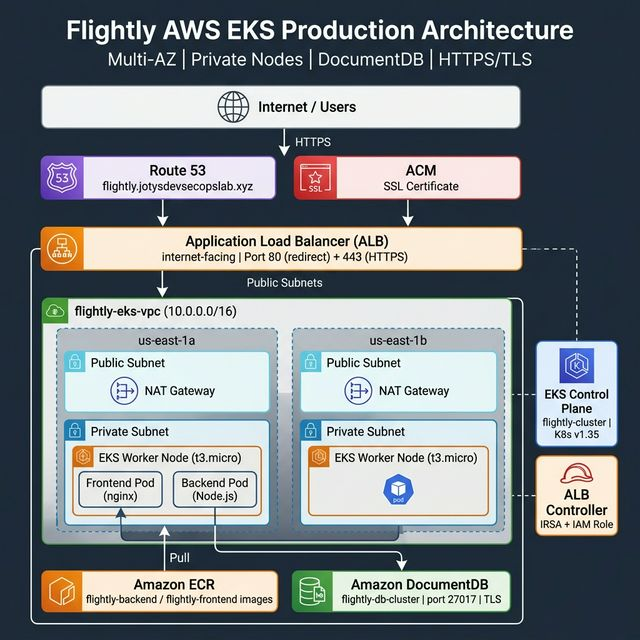

### Key Infrastructure Pillars:
- **Security**: All compute (EKS Nodes) and data (DocumentDB) reside in **Private Subnets**.
- **Edge**: Route 53 DNS integrates with AWS Certificate Manager (ACM) for end-to-end SSL/TLS.
- **Traffic**: AWS Application Load Balancer (ALB) serves as the entry point, managed by the AWS Load Balancer Controller.
- **Persistence**: Managed Amazon DocumentDB for high availability and automated scaling.

---

## Phase 1: Infrastructure Foundations

### 1. Network & VPC Preparation
A custom VPC was architected to isolate compute resources from the public internet.


- **Service**: Amazon VPC
- **Configuration**:
  - **Topology**: 2 Availability Zones for high availability.
  - **Subnet Strategy**: 2 Public Subnets (Ingress) and 2 Private Subnets (Workloads/Data).
  - **Gateway**: 1 NAT Gateway to allow private instances to reach the internet for updates.
  - **CIDR**: `10.0.0.0/16`


---

### 2. Container Image Registry (Amazon ECR)
We established a secure, private registry for our microservices.

- **Action**: Provisioned private ECR repositories for both Frontend and Backend services.
- **CI/CD Logic**: Manually performed build-tag-push flow to simulate a delivery pipeline.

#### Backend Registry Pipeline:


#### Frontend Registry Pipeline:


#### ECR Dashboard Verification:


---

### 3. Database Provisioning (Amazon DocumentDB)
To ensure data durability and performance, we opted for a managed DocumentDB cluster.

- **Service**: Amazon DocumentDB (MongoDB compatible).
- **Security Layer**: 
  - Placed in a dedicated **Subnet Group** across private subnets.
  - **Security Group (Firewall)**: Restricted to accept inbound TCP `27017` only from the VPC CIDR.


---

## Phase 2: Kubernetes Compute Layer

### 4. EKS Control Plane Setup
Provisioning the managed Kubernetes control plane with fine-grained IAM permissions.

- **IAM Role**: Created `flightly-eks-cluster-role` with `AmazonEKSClusterPolicy`.
- **EKS Config**: Cluster version `1.35` with Public/Private endpoint access enabled.
- **Note**: "Auto Mode" was disabled to maintain manual control over networking and compute.


---

### 5. Managed Node Groups (Worker Nodes)
Adding compute capacity while adhering to cost-effective burstable instance types.

- **Instance Type**: `t3.micro` (Optimized for PoC costs).
- **Networking**: Nodes are strictly placed in **Private Subnets** to prevent direct external access.
- **Desired Capacity**: 2 Nodes across 2 AZs.

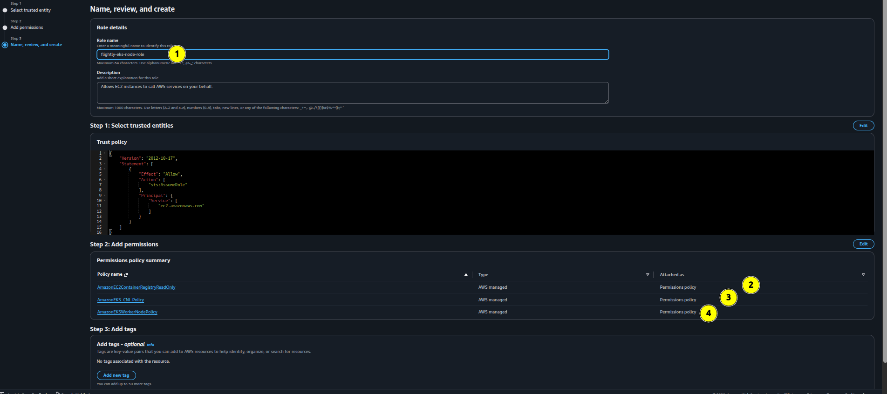

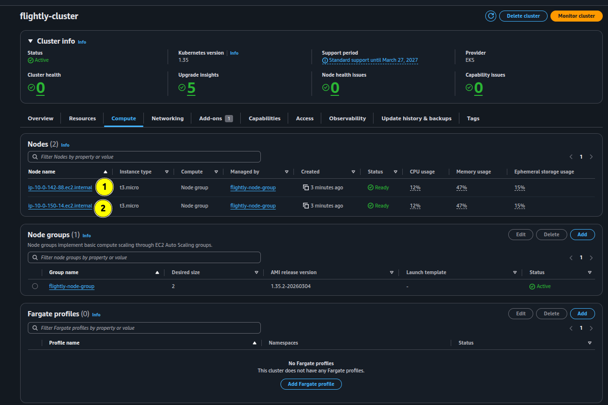

---

### 6. Cluster Governance & Authentication
Configuring local machine access to the remote cluster via the AWS CLI.

```bash
aws eks update-kubeconfig --region us-east-1 --name flightly-cluster
kubectl get nodes
```

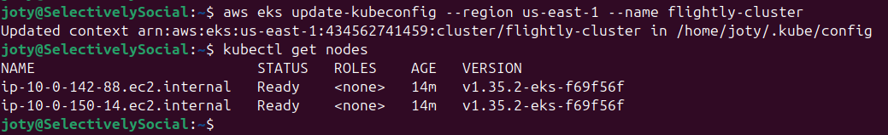

---

## Phase 3: Application Delivery & Security

### 7. AWS Load Balancer Controller Installation
Integrating EKS with native AWS Load Balancing services.

1. **IAM OIDC Provider**: Configured the cluster to support Service Account IAM roles (IRSA).
2. **Controller Deployment**: Installed the AWS Load Balancer Controller via **Helm**.

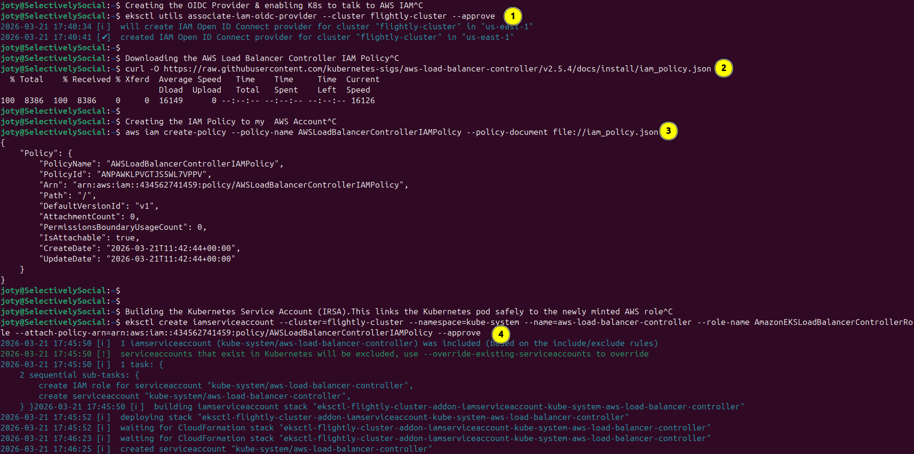
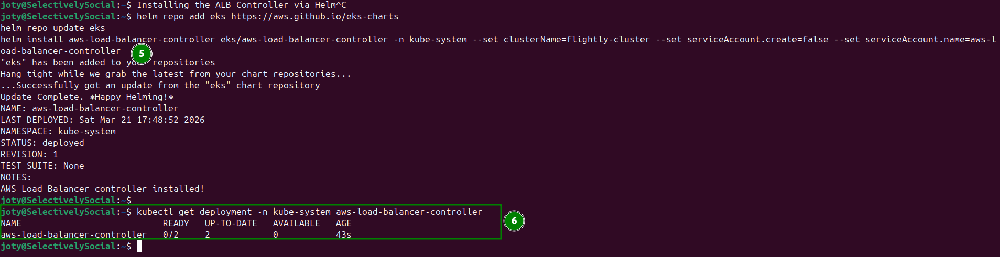

---

### 8. Production Deployment & Secret Management
Applying production-ready Kubernetes manifests and overlaying AWS-specific configurations.

- **Kustomize Overlays**: Used to inject ECR image URIs and specify the `alb` Ingress class.
- **Secrets Management**: Manually injected DocumentDB credentials as a `kubectl` secret to avoid hardcoding.

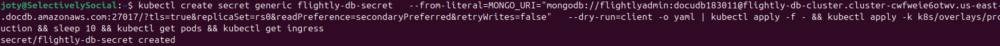
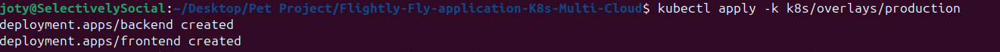
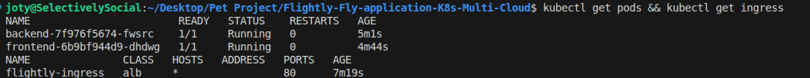

---

### 9. Edge Networking: Route 53 & SSL/TLS
Finalizing the public-facing entry point with custom domain and HTTPS.

- **Service**: AWS Certificate Manager (ACM) & Route 53.
- **SSL Certificate**: Provisioned a public certificate for `flightly.jotysdevsecopslab.xyz`.
- **DNS Record**: Created an **A-record Alias** pointing the domain to the ALB DNS name.

#### Certificate Issuance (ACM):
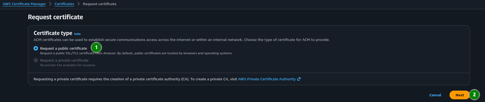
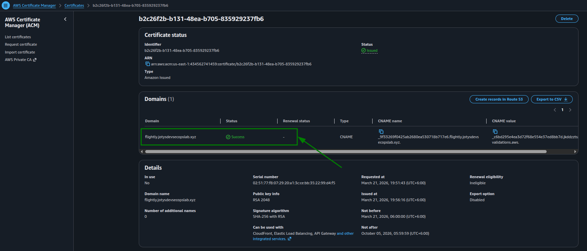

#### Ingress Re-Configuration (Phase B):
Updated Ingress annotations to enable **SSL Redirect (HTTP -> HTTPS)** and attach the `certificate-arn`.

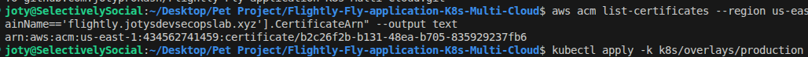
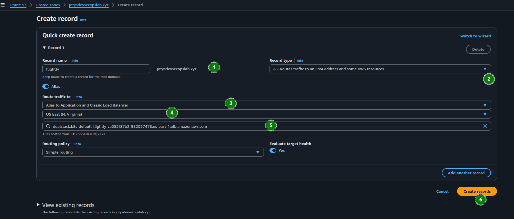

---

## 🚀 The Result: Application Live
The application is now fully provisioned and securely serving traffic at:
**[https://flightly.jotysdevsecopslab.xyz](https://flightly.jotysdevsecopslab.xyz)**

### Verification:
The site is live with a valid SSL padlock and a fully operational Frontend-to-Backend-to-Database flow.

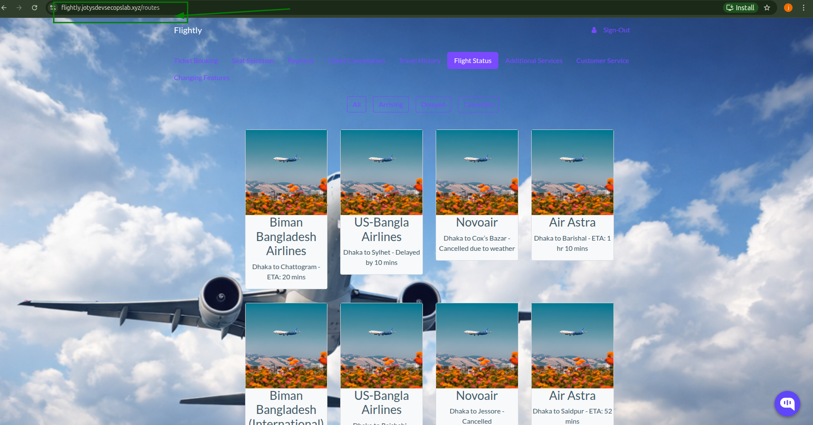
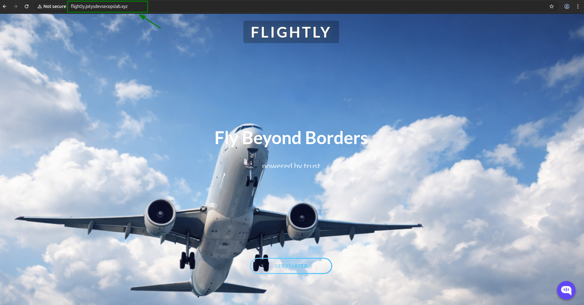
