# Phase 2: Flightly AWS EKS Manual Dashboard PoC

This Proof of Concept (PoC) demonstrates how to manually provision our production-grade architecture using the **AWS Management Console** dashboard, clicking through the UI rather than relying entirely on infrastructure-as-code or CLI tools. This is a crucial step for understanding the underlying AWS components before automating them.

We are deploying the architecture documented in our implementation plan: VPC, ECR, DocumentDB, EKS, and ALB + Route 53.

## 1. Network & VPC Preparation
Before spinning up the EKS cluster, we need our VPC and subnets defined according to best practices.

**Architecture Diagram Overview:**
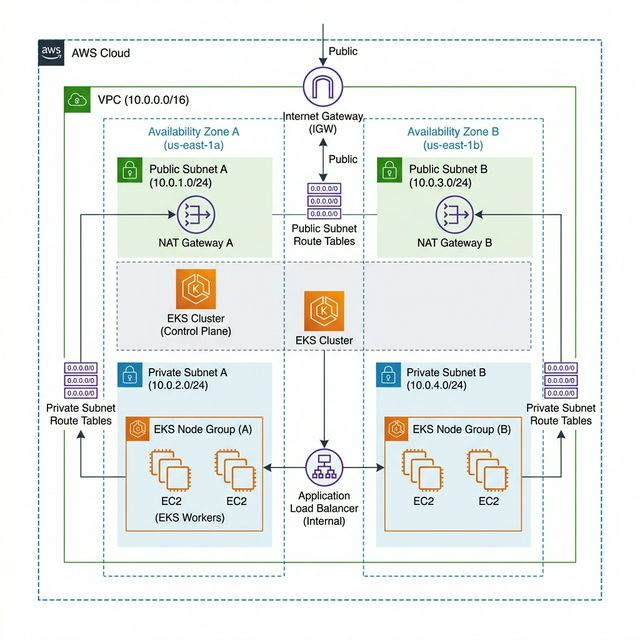

- **Service**: VPC
- **Action**: Use the "VPC and more" creation wizard.
- **Settings**:
  - Name tag auto-generation: `flightly-eks-vpc`
  - IPv4 CIDR block: `10.0.0.0/16`
  - Number of Availability Zones (AZs): 2
  - Number of public subnets: 2
  - Number of private subnets: 2 (for EKS Nodes and Database)
  - NAT gateways: 1 in AZ.

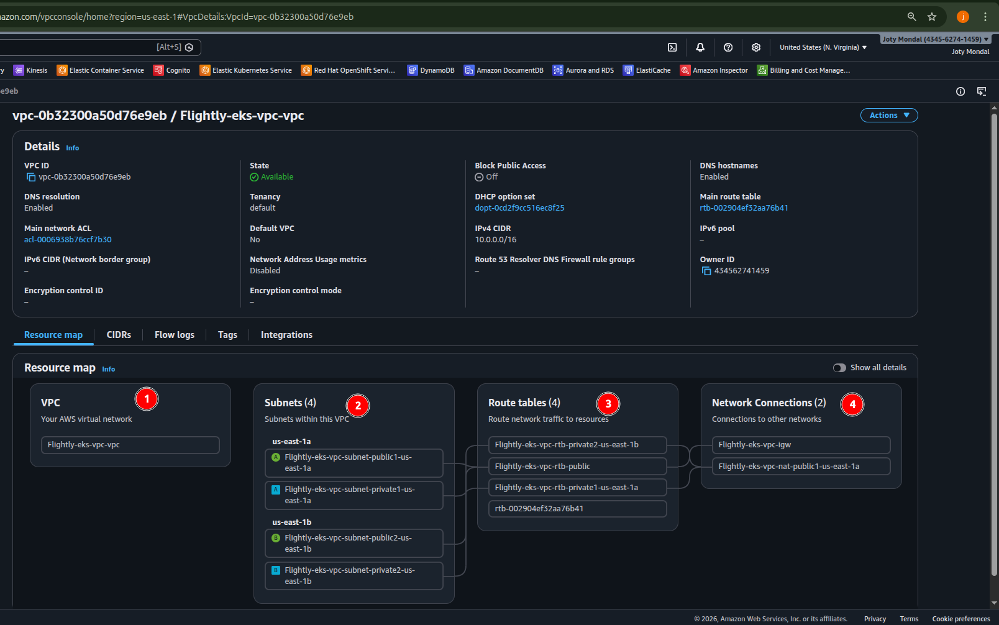

- **Result**: You now have a solid network foundation spanning `us-east-1a` and `us-east-1b` (or your chosen region).

## 2. Container Image Registry (Amazon ECR)
We must store the Docker images for the Frontend and Backend.
- **Service**: Amazon ECR (Elastic Container Registry) -> Private registry
- **Action**: Create two repositories.
- **Repo 1**: `flightly-backend`
- **Repo 2**: `flightly-frontend`
- **Manual Push**: Navigate into each repository, click "View push commands" in the top right, and follow the CLI steps on your local machine to authenticate Docker, build, tag, and push your images to AWS.

### ECR Backend CLI Execution
*(Building, tagging, and pushing `flightly-backend`)*
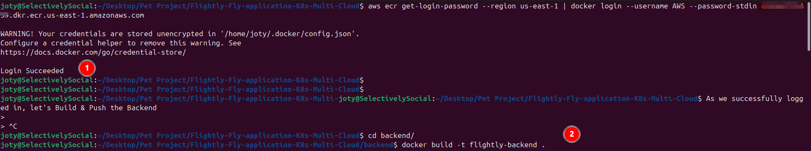
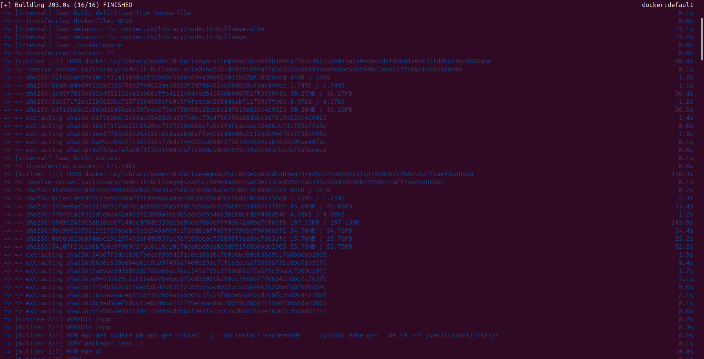
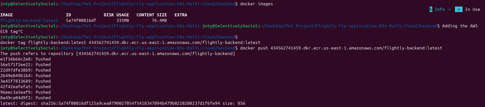

### ECR Frontend CLI Execution
*(Building, tagging, and pushing `flightly-frontend`)*
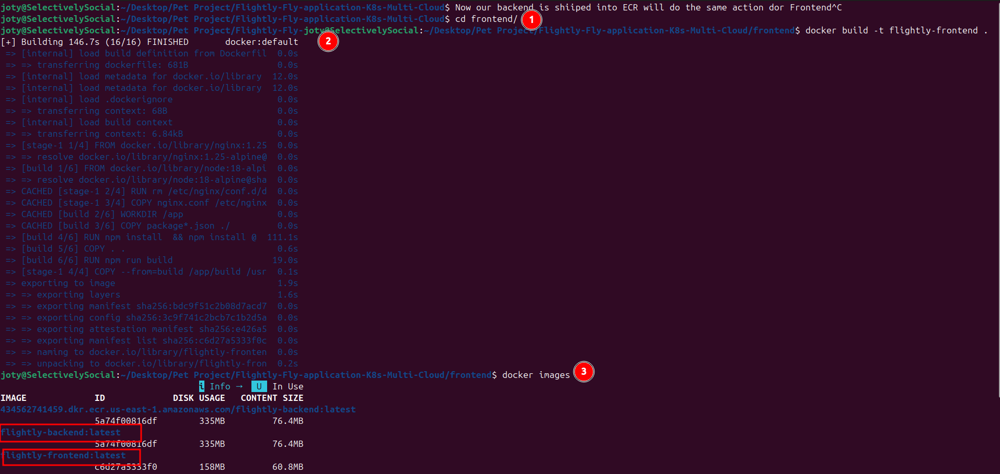
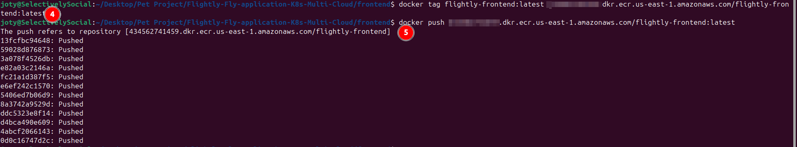

### ECR AWS Dashboard Evidence
*(Verifying the images in the ECR Repositories)*
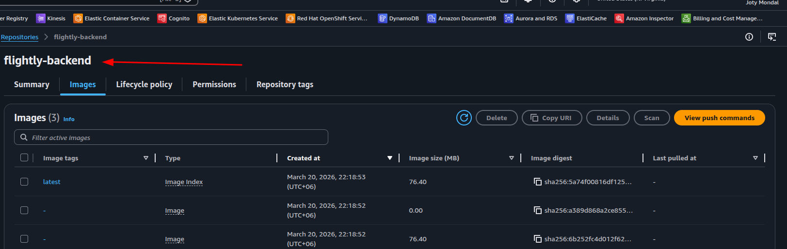
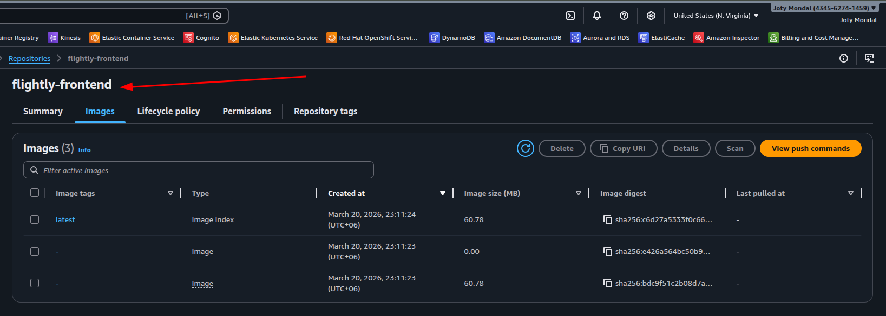

## 3. Database Provisioning (Amazon DocumentDB)
Instead of a containerized MongoDB, we'll provision a robust Managed Database.
- **Service**: Amazon DocumentDB
- **Action**: Create cluster.
- **Settings**:
  - Instance class: `db.t3.medium` *(Note: This is the smallest/cheapest instance type available for DocumentDB).*
  - Number of instances: 1 (Primary only. We will skip the Replica to save costs for this PoC).
  - Connectivity: Select the `flightly-eks-vpc`. Assign it to the private subnets.
  - Authentication: Choose a solid Master username and password. **Save these.**
- **Security Group**: After creation, edit the Database Security Group to allow inbound TCP on port `27017` from the VPC CIDR (`10.0.0.0/16`).

### DocumentDB Subnet Group
*(Mapping the isolated Private Subnets to the Database)*
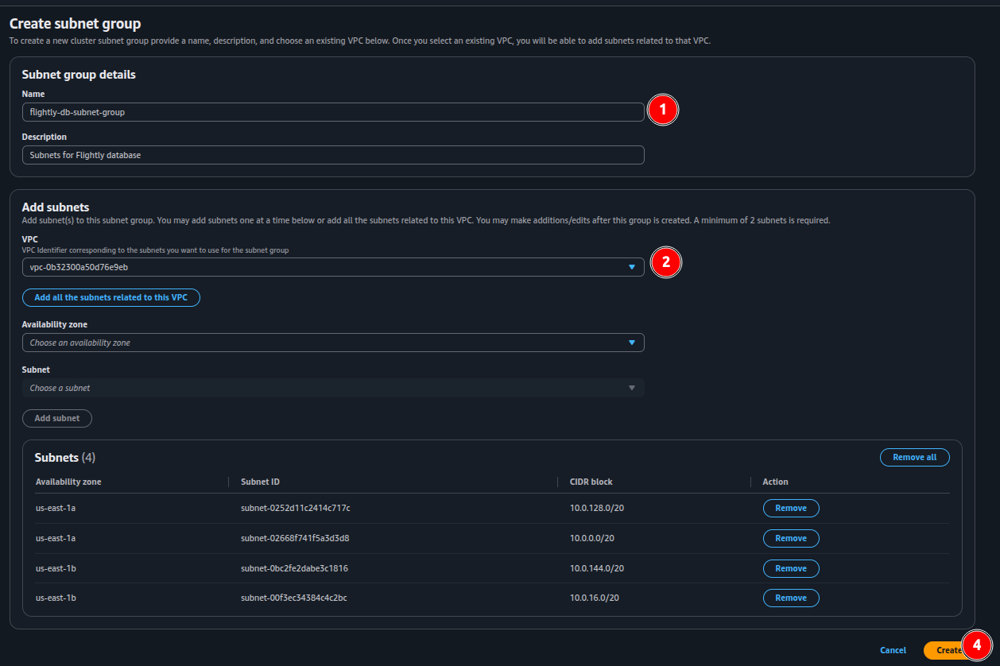

### DocumentDB Cluster Creation
*(Cost-optimized configuration for the DB Engine)*
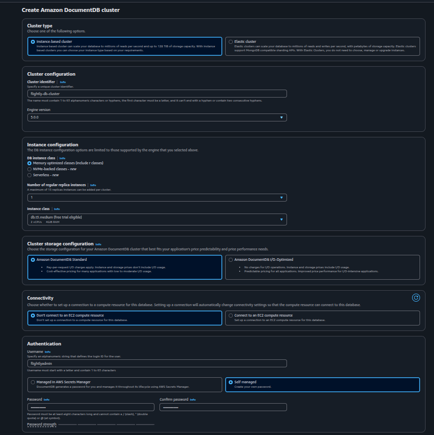
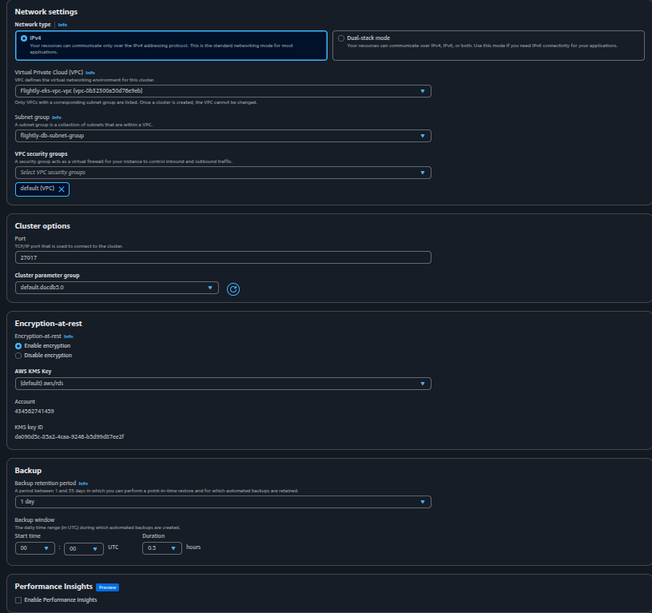

### DocumentDB Cluster Available
*(Database successfully deployed inside the `flightly-eks-vpc`)*
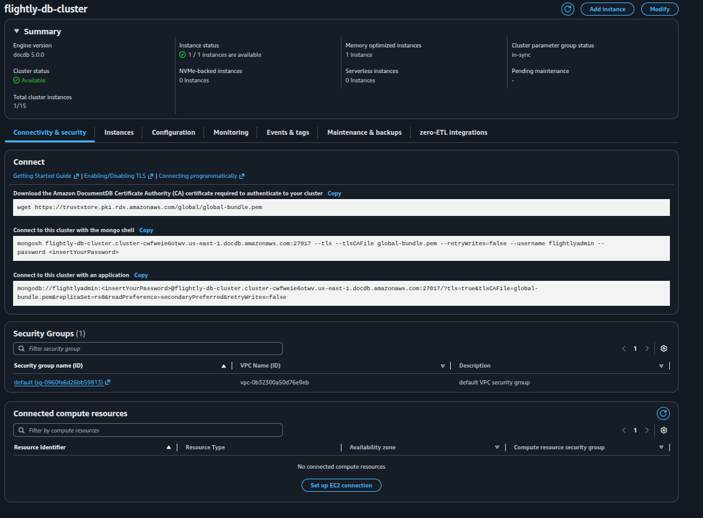

### DocumentDB Security Group Firewall
*(Allowing `27017` traffic from the VPC to the database)*
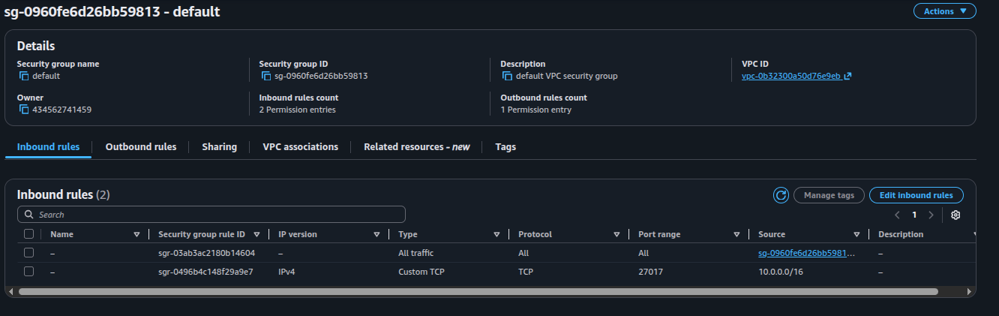

## 4. Kubernetes Control Plane (Amazon EKS)
Now we provision the actual EKS cluster.
- **Prerequisite Role**: Go to IAM -> Roles -> Create Role -> AWS Service -> EKS. Name it `flightly-eks-cluster-role`.

  *(EKS Cluster IAM Role)*
  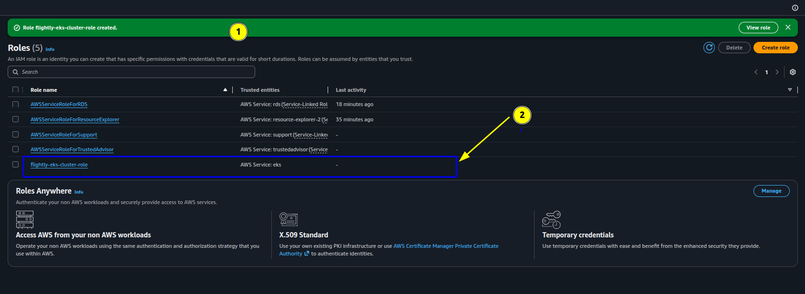

- **Service**: Amazon EKS -> Clusters -> Create
- **Settings**:
  - Name: `flightly-cluster`
  - Version: `1.35` (or latest available)
  - Role: Select the `flightly-eks-cluster-role`.
  - Configuration: Use **Custom configuration** (disable EKS Auto Mode).
  - Networking: Select `flightly-eks-vpc`. Select ALL Private AND Public subnets.
  - Endpoint Access: **Public and private**.
- **Note**: Click "Create" and wait (this can take 10-15 minutes).

### EKS Cluster Configuration
*(Selecting custom configurations and disabling Auto Mode)*
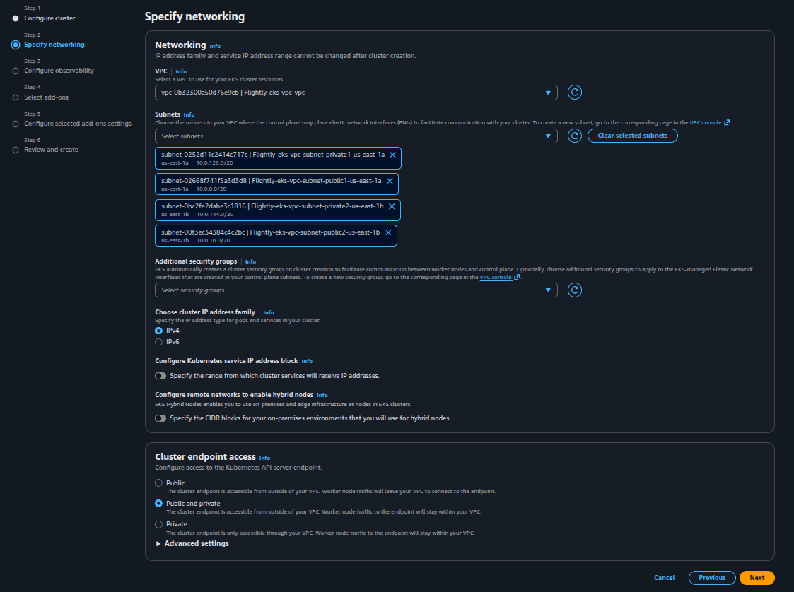

*(Networking step placing the cluster in flightly-eks-vpc)*
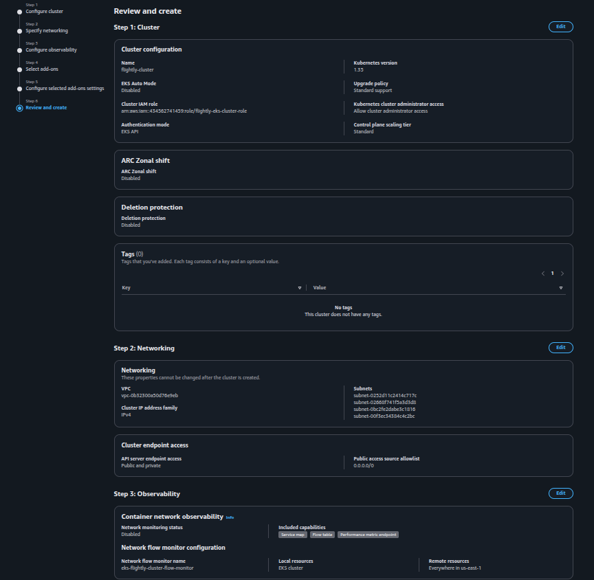

## 5. EKS Compute (Worker Nodes)
Once the cluster (`flightly-cluster`) shows an **Active** status, we must add compute capacity. **We will use minimal compute to save costs.**
- **Prerequisite Role**: Created `flightly-eks-node-role` in IAM for the EC2 worker nodes.
- **Action**: In the EKS Cluster Dashboard, go to the **Compute** tab -> **Add Node Group**.
- **Settings**:
  - Name: `flightly-node-group`
  - Node IAM Role: `flightly-eks-node-role`
  - Subnets: Select your **Private subnets** only (Pods should run in the private subnets).
  - Instance type: `t3.micro` *(This is a very cheap burstable instance. It has enough RAM (1GB) to run Node.js and React).*
  - Desired size: 2.

### EKS Node Group Configuration
*(Attaching t3.micro instances and the EC2 Node IAM Role)*
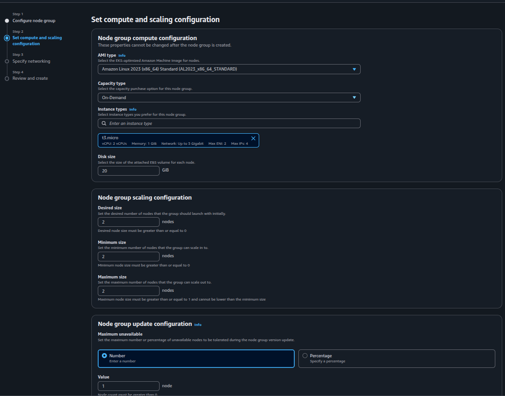

### EKS Worker Nodes Active
*(Verifying the nodes have successfully registered with the cluster)*


## 6. Accessing the Cluster
With the cluster running, map your local `kubectl` to it.
```bash
aws eks update-kubeconfig --region <your-region> --name flightly-cluster
kubectl get nodes
```
*(You should see your two `t3.medium` nodes in 'Ready' state).*

## 7. ALB Controller & Ingress
Because we want an AWS Application Load Balancer to handle traffic, we must install the ALB Controller. *Note: this step requires some CLI interaction on your local machine to setup IAM points*.
1. Create an IAM policy based on the AWS Load Balancer Controller JSON.
2. Use `eksctl` or AWS Console (OIDC providers) to associate an IAM Role for a Service Account (IRSA).
3. Apply the controller using `helm`.
*(We will detail these specific command-line steps in the technical execution phase, as they are hard to do purely via dashboard clicks).*

## 8. Deployment Updates
Finally, modify your local Kubernetes manifests (`/k8s` folder):
1. **Backend Deployment**: Change the `image:` to your AWS ECR URI. Update the `MONGO_URI` secret to point to your new DocumentDB endpoint.
2. **Frontend Deployment**: Change the `image:` to your AWS ECR URI.
3. **Ingress**: Update your ingress class and annotations to `alb`. Attach your ACM Certificate ARN to the ingress annotations to enable HTTPS.

Apply the files: `kubectl apply -k k8s/overlays/production` (or equivalent).

## 9. DNS Finalization (Route 53)
- **Service**: Route 53 -> Hosted Zones
- **Action**: Select your domain. Create a new "A" record.
- **Settings**:
  - Toggle "Alias" to ON.
  - Route traffic to: Alias to Application and Classic Load Balancer.
  - Choose the ALB that was just automatically created by your K8s Ingress.
- **Verification**: Navigate to your domain, verify the green padlock (ACM SSL is working), and test the frontend-to-backend data flow through the load balancer.
