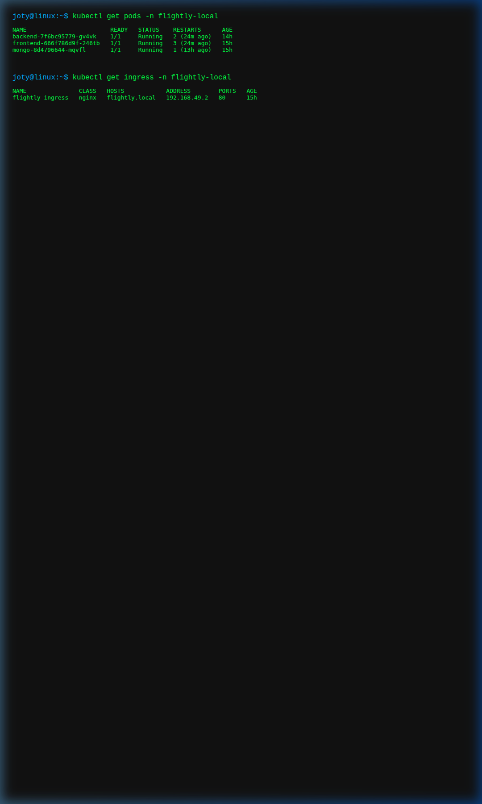
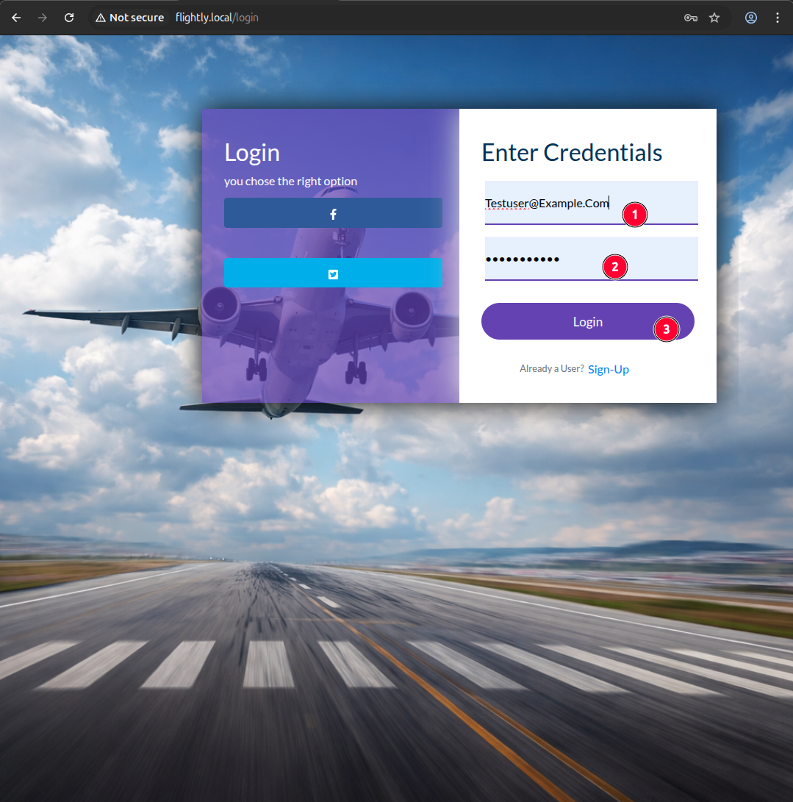
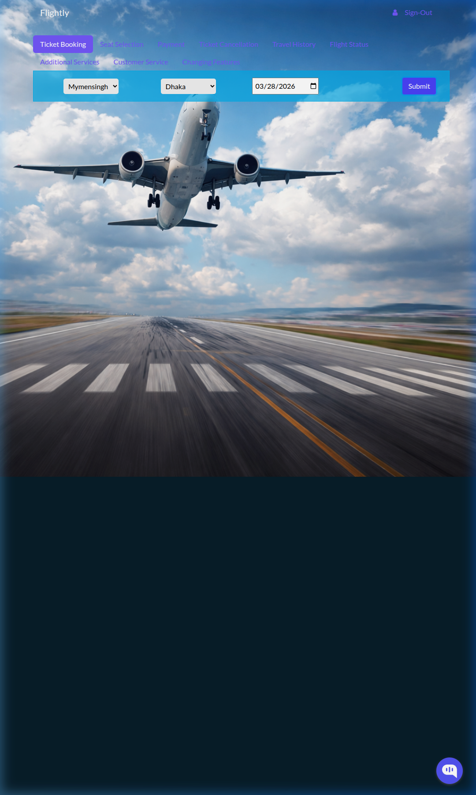

# Flightly Minikube PoC Walkthrough

The application has been successfully normalized and deployed to a local Minikube cluster. This PoC confirms that the full-stack user journey (Registration, Login, Flight Search, and Booking) works correctly through a Kubernetes Ingress.

## 1. Environment Status
The system is running on Minikube with all components (Frontend, Backend, MongoDB) healthy.

*Pod and Ingress status showing healthy Running state.*

## 2. API Connectivity
Basic connectivity tests confirm that the NGINX Ingress is correctly routing traffic to both the React frontend and the Express backend.

*Curl health checks returning 200 OK via the Ingress.*

## 3. User Journey Verification

### Login Phase
The user can access the login interface and authenticate against the MongoDB backend using JWT.

*The Login UI correctly rendered and functional.*

### Booking Phase
Once logged in, the user can search for flights and proceed to selection. The application correctly handles relative `/api` routing.

*Authenticated booking interface showing flight selection.*

## 4. Conclusion
The normalization project is complete. The application is now ready for GitOps-style deployment in a production environment (such as EKS) using the established Kustomize structure.
