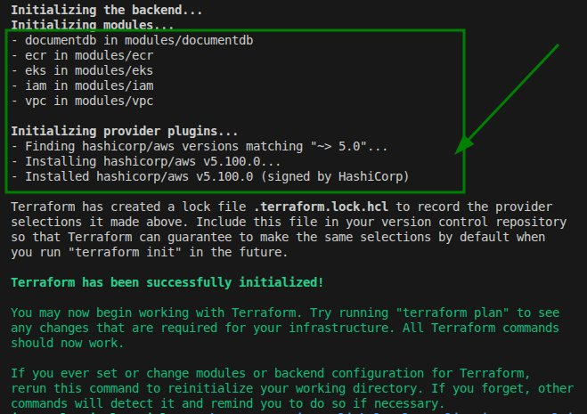
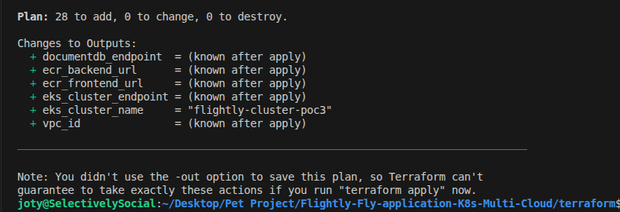
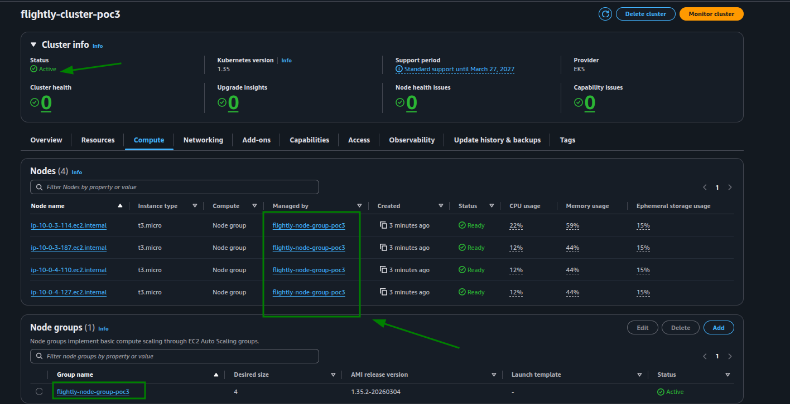
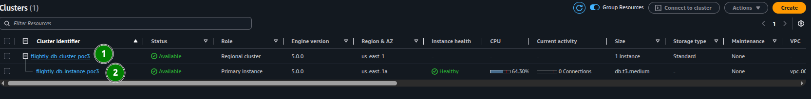

# Phase 3: Flightly Terraform IaC PoC

This Proof of Concept (PoC) demonstrates automating our production-grade architecture using **Terraform**, rather than manually provisioning via the AWS Management Console dashboard. This builds upon Phase 2 to ensure reproducible infrastructure-as-code while maintaining identical architecture (VPC, EKS, DocumentDB, and Application Load Balancer foundations).

## 1. Project Initialization & Validation
- **Action**: Initialize Terraform modules
- **Command**:
  ```bash
  cd terraform
  terraform init
  ```

### Terraform Initialization Execution
*(Initializing the AWS provider and configuring local backend)*


## 2. Infrastructure Plan (Dry-Run)
Before applying changes, we securely run the Terraform plan to review the execution steps and confirm 0 potential mistakes.
- **Action**: Run the Terraform plan safely.
- **Environment**: Export sensitive database values.
- **Command**:
  ```bash
  export TF_VAR_db_master_username="flightlyadmin"
  export TF_VAR_db_master_password="SecureFlightlyPassword123!"
  terraform plan -out=tfplan
  ```

### Terraform Plan Output
*(Verifying the execution plan for VPC, EKS, DocDB, ECR without modifying state)*


## 3. Automated Provisioning (Deployment)
- **Action**: Apply the generated execution plan to spin up AWS resources.
- **Command**:
  ```bash
  terraform apply tfplan
  ```

### AWS Resources Deployed
*(Terminal output showing successfully provisioned architecture including EKS, VPC, and ECR endpoints)*


## 4. Visual Verification (AWS Console)
To prove the Terraform code perfectly deployed our architecture, we visually verify the AWS components exactly as we did in PoC 2.

### EKS Cluster Configuration
*(EKS cluster Active with 4 **t3.micro** worker nodes instantiated via module)*


### DocumentDB Cluster Available
*(DocumentDB instance Available and properly attached to our private subnet group)*

