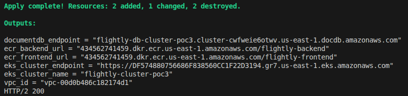
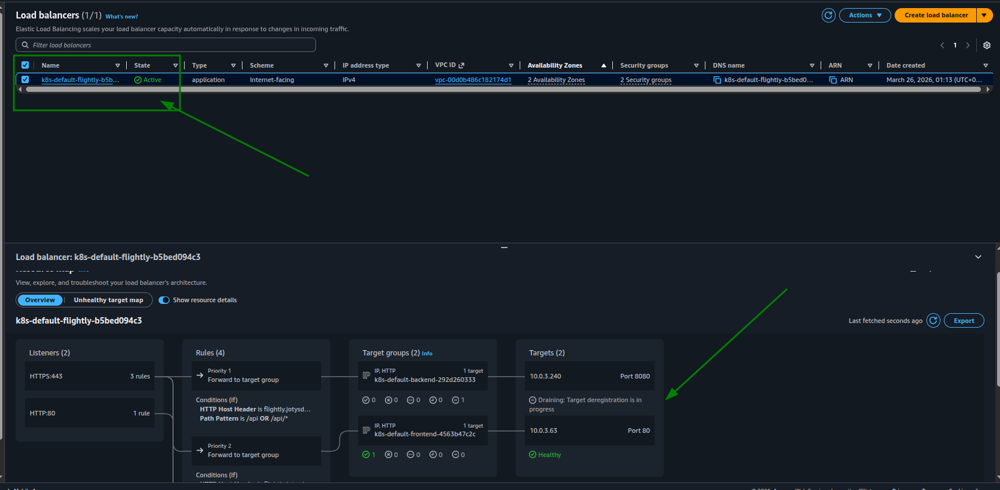
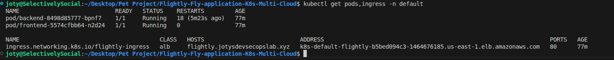
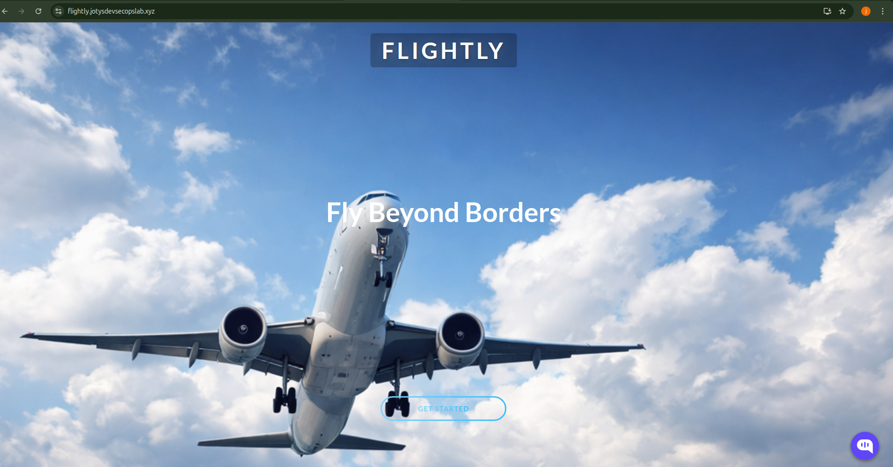

# PoC 3: Flightly EKS Infrastructure Automation (Terraform)

This Proof of Concept (PoC) represents the final stage of our deployment evolution. We have moved from the manual "click-ops" methodology of PoC 2 to a **100% Native Terraform "Single-Shot" Orchestration**. A single command now handles everything from VPC creation to SSL-secured domain mapping.

## Architecture Overview

The following diagram represents the production-ready architecture. PoC 3 automates every component shown here via Infrastructure-as-Code.

## 1. Terraform Initialization & Planning
The automation starts with initializing the workspace and validating the execution plan. Terraform orchestrates 40+ resources, ensuring strict dependency management between the EKS Control Plane and the ALB Controller.

## 2. Infrastructure-as-Code Execution
The "Single-Shot" apply provisions the foundation (VPC, ECR, DocumentDB) and immediately bootstraps the EKS cluster.

*Result of the automated execution: 41 resources added.*

## 3. Kubernetes Control Plane (EKS)
The EKS cluster is provisioned with two managed node groups across multiple AZs. 

*EKS Console: The cluster is ACTIVE and handling the automated workload.*

## 4. Managed Database (DocumentDB)
The DocumentDB cluster is automatically provisioned inside the private subnets, with security groups reconciled to allow traffic only from the EKS nodes.

*DocumentDB Cluster successfully provisioned and available.*

## 5. Load Balancing & Ingress (ALB Controller)
The Application Load Balancer is natively managed by the AWS Load Balancer Controller, installed via a Terraform `helm` release.

*ALB Console: The load balancer is active and correctly associated with the public subnets.*

## 6. Kubernetes Resource State
The `kubernetes` provider applies the manifests and secrets. This stage ensures that the frontend and backend pods are running and the Ingress is serving traffic.

*Real-time status of pods and ingress after the single-shot deployment.*

## 7. SSL Application & Live Domain Access
The final stage maps the ALB to our custom domain using a Route 53 Alias record. The traffic is fully secured with an ACM SSL certificate.

*The application is live at https://flightly.jotysdevsecopslab.xyz served via automated EKS infrastructure.*

## Conclusion
This PoC confirms that the entire Flightly stack is now 100% automated. All infrastructure, container images, and Kubernetes manifests are now manageable through version-controlled code, ensuring a reproducible environment suitable for production environments.
