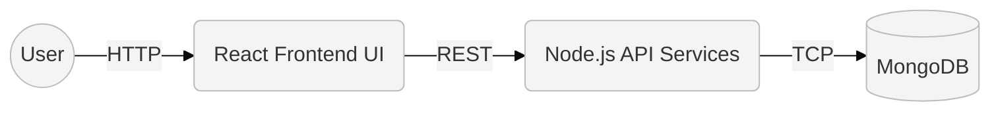

# Flightly

[](LICENSE)


Flightly is a full-stack airline reservation and management system designed for robust, scalable deployment.


## Architecture

- **Frontend:** React (SPA)
- **Backend:** Node.js, Express (REST API)
- **Database:** MongoDB
- **Infrastructure:** Docker, Kubernetes



## Quick Start (Docker)

The fastest way to spin up the entire stack locally:

```bash
docker compose up -d
```
- Frontend Access: `http://localhost:3000`
- Backend API: `http://localhost:5000`

## Local Deployment (Manual)

For active development, you can run the services natively.

1. **Database**: Ensure MongoDB is installed and running locally on port `27017`.
2. **Backend**:
   ```bash
   cd backend && npm install && npm run devStart
   ```
3. **Frontend**:
   ```bash
   cd frontend && npm install && export NODE_OPTIONS=--openssl-legacy-provider && npm start
   ```

> **Note**: For detailed system requirements and fresh dependency installation (e.g., Ubuntu package commands for MongoDB/Node.js), refer to the [Local Development Guide](./docs/local-development.md).

## Kubernetes Deployment

To deploy Flightly to a local Kubernetes cluster, navigate to the Kubernetes deployment directories. A guided reference for Minikube is available in the [Minikube Walkthrough](./minikube-1/02-minikube/walkthrough.md).

## Contributing

Contributions are welcome. Please ensure any feature additions are accompanied by appropriate test coverage and documentation updates to maintain project stability.
