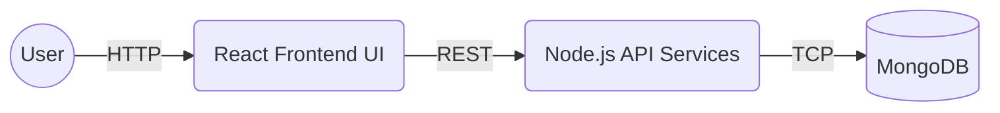
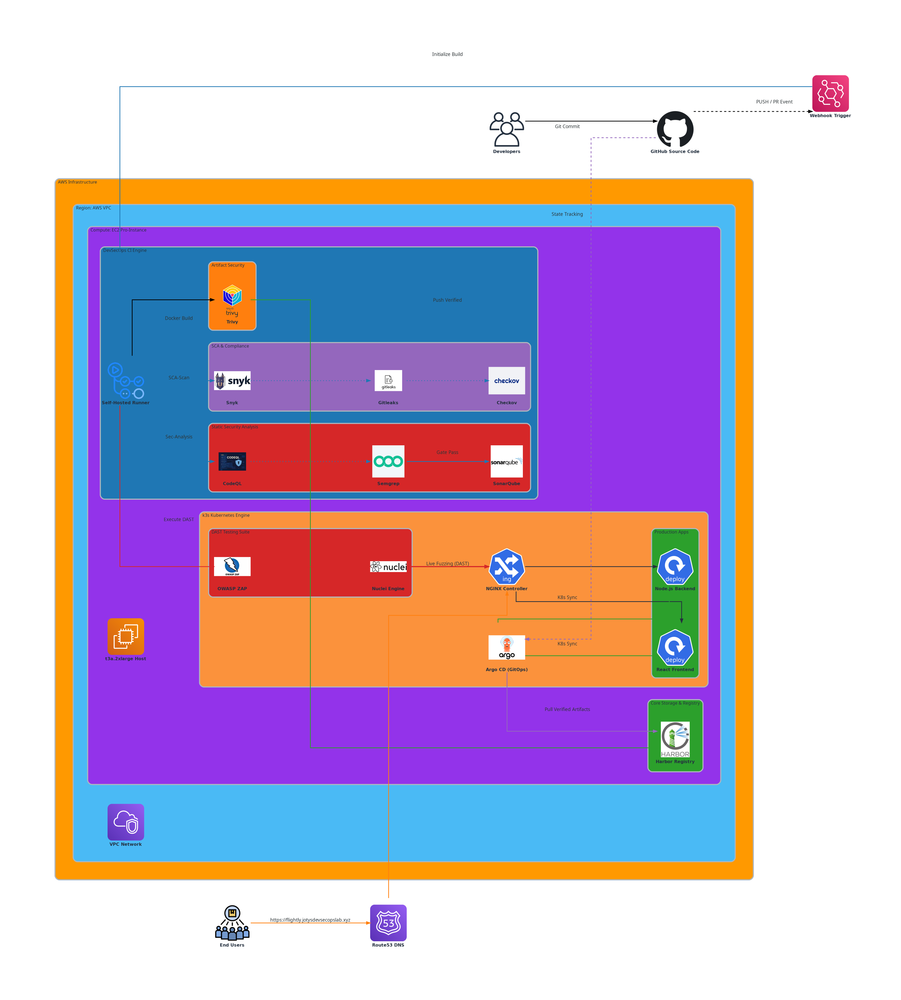

# Flightly

     

Flightly is a full-stack airline reservation and management system designed for robust, scalable deployment.


## Architecture

- **Frontend:** React (SPA)
- **Backend:** Node.js, Express (REST API)
- **Database:** MongoDB
- **Infrastructure:** Docker, Kubernetes



## Quick Start (Docker)

The fastest way to spin up the entire stack locally:

```bash
docker compose up -d
```
- Frontend Access: `http://localhost:3000`
- Backend API: `http://localhost:5000`

## Local Deployment (Manual)

For active development, you can run the services natively.

1. **Database**: Ensure MongoDB is installed and running locally on port `27017`.
2. **Backend**:
   ```bash
   cd backend && npm install && npm run devStart
   ```
3. **Frontend**:
   ```bash
   cd frontend && npm install && export NODE_OPTIONS=--openssl-legacy-provider && npm start
   ```

> **Note**: For detailed system requirements and fresh dependency installation (e.g., Ubuntu package commands for MongoDB/Node.js), refer to the [Local Development Guide](./docs/local-development.md).

## ☁️ Cloud & Kubernetes Deployments

This repository documents the incremental evolution of the application's infrastructure from local development to a production-ready cloud environment.

### PoC 1: Local Orchestration (Minikube)
The initial deployment strategy focuses on containerization and basic Kubernetes orchestration using Minikube. 
👉 [View PoC 1 Walkthrough](./Deployment%20POC/Minikube-POC-1/walkthrough.md) 

### PoC 2: Production AWS Architecture (Amazon EKS)
Graduating from local development, the application is deployed into a fully managed, highly available AWS environment using EKS, DocumentDB, and an Application Load Balancer.


👉 [View PoC 2 Detailed Walkthrough & Deployment Guide](./Deployment%20POC/AWS-EKS-Manual-POC-2/walkthrough.md)

### PoC 3: Automated Infrastructure (Terraform)
Full infrastructure automation using modular Terraform. Transitioned from manual AWS provisioning to Infrastructure as Code (IaC), including automated EKS, DocumentDB, VPC, and ECR setup with integrated application deployment.

👉 [View PoC 3 Detailed Walkthrough & IaC Guide](./Deployment%20POC/Terraform-IaC-POC-3/walkthrough.md)

### PoC 4: Production DevSecOps Platform (Advanced Security & GitOps)
The final evolution of the project into a professional-grade DevSecOps platform. This PoC integrates automated security gates (SAST, SCA, DAST), self-hosted GitHub runners, and GitOps synchronization with Argo CD for total infrastructure and application security.



👉 [View PoC 4 Detailed DevSecOps & Security Guide](./devsecops/walkthrough-poc4.md)

## Contributing


Contributions are welcome. Please ensure any feature additions are accompanied by appropriate test coverage and documentation updates to maintain project stability.
